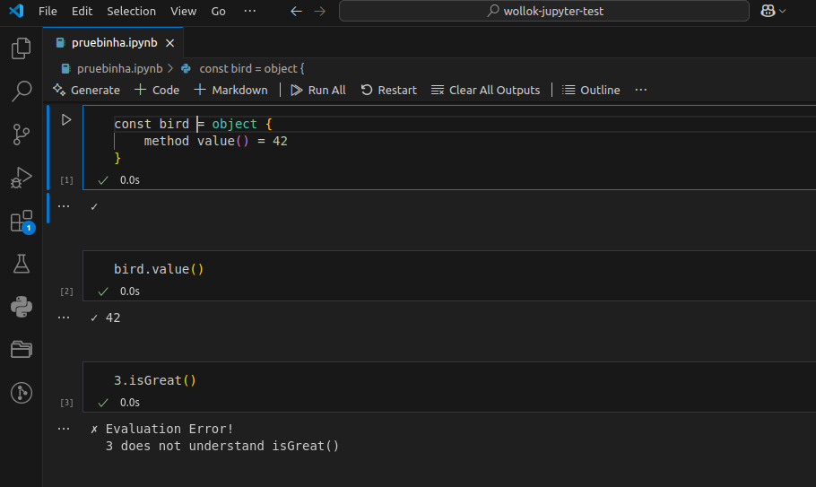
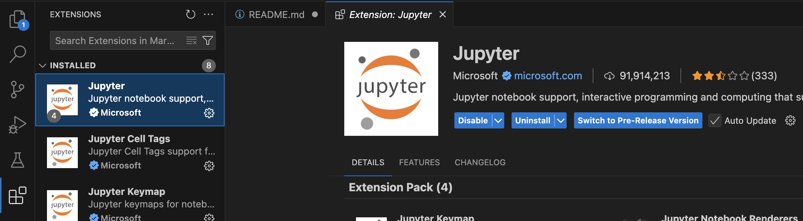
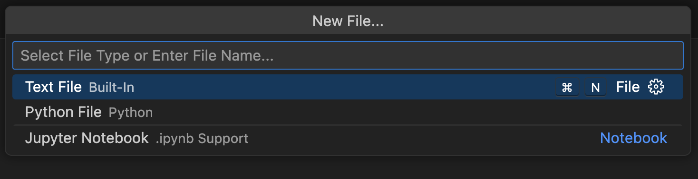
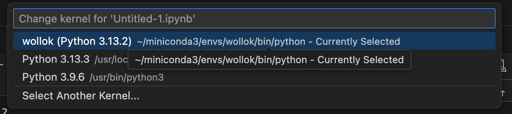

[](https://github.com/uqbar-project/wollok-jupyter-kernel/actions/workflows/test.yml)


## Wollok Kernel for Jupyter notebook

`wollok_kernel` is a Jupyter kernel implementation, started from [a wrapper kernel](http://jupyter-client.readthedocs.io/en/latest/wrapperkernels.html).



## Installation

### Pre-requisites

You need to install **Python** (3.7 or newer). If you don't have Python, the recommended option is installing it using the [official site](https://www.python.org/downloads/), and click on `Download Python X.X.X` (there a different options depending on your operating system).

```bash
python --version
```

If `python3 --version` works, you should use an alias or replace python with python3.

It is recommended to create a virtual environment:

```bash
python -m venv venv
source venv/bin/activate  # Linux/macOS
venv\Scripts\activate     # Windows
```

Install **jupyter client**, **kernels system** and **notebooks infrastructure**:

```bash
pip install jupyter ipykernel
```

### Wollok Kernel

Clone this repository

```bash
git clone https://github.com/uqbar-project/wollok-jupyter-kernel # you can also use git@... option
```

Install Conda.
TODO: add instructions.

Install Wollok Jupyter Kernel

```bash
cd ./wollok-jupyter-kernel/wollok_kernel
conda create -n wollok jupyter
conda init
# Restart a new terminal and run
conda activate wollok
cd ..
pip install .
jupyter kernelspec install . --sys-prefix --name wollok --replace
```

After downloading all the dependencies, you can check that Wollok kernel is successfully installed:

```bash
jupyter kernelspec list
```

You should see an output similar to the following:

```bash
Available kernels:
  python3    /path/to/venv/lib/python3.13/site-packages/ipykernel/resources
  wollok     /path/to/wollok-jupyter-kernel/venv/share/jupyter/kernels/wollok
```

### VSCode

Install Jupyter extension in VSCode:

- Open Extension Tab (⇧⌘X or Ctrl+Shift+X)
- Look for "Jupyter"
- Install Microsoft official extension



Then you can create a New File... > Jupyter Notebook



And select kernel: click on the right side, on `Select Kernel` option > Jupyter Kernel > Wollok:





## Contribution

If you want to collaborate, follow the [developer instructions](https://github.com/uqbar-project/wollok-jupyter-kernel/wiki/Developer-environment).


## Using Wollok kernel

- **Notebook**: The *New* menu in the notebook should show an option for a Wollok notebook.
- **Console frontends**: To use it with the console frontends, add ``--kernel wollok`` to their command line arguments.
